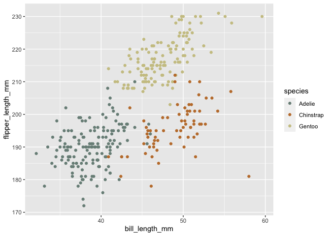

Homework 1
================
Megan Marziali
September 13, 2020

This document contains homework one for the Building Blocks section of
P8105.

# Problem 1

The **code chunk** below involves the creation of a data frame with
various types of variables.

``` r
library(tidyverse)
```

    ## ── Attaching packages ───────────────────────────────────────── tidyverse 1.3.0 ──

    ## ✓ ggplot2 3.3.0     ✓ purrr   0.3.4
    ## ✓ tibble  3.0.1     ✓ dplyr   0.8.5
    ## ✓ tidyr   1.1.0     ✓ stringr 1.4.0
    ## ✓ readr   1.3.1     ✓ forcats 0.5.0

    ## ── Conflicts ──────────────────────────────────────────── tidyverse_conflicts() ──
    ## x dplyr::filter() masks stats::filter()
    ## x dplyr::lag()    masks stats::lag()

``` r
prob_one_df = tibble(
  vec_norm = rnorm(10),
  vec_char = c("the", "quick", "brown", "fox", "jumped", "over", "the", "lazy", "dog", "today"),
  vec_factor = factor(c("the", "the", "the", "fuzzy", "fuzzy", "fuzzy", "cat", "cat", "cat", "cat")),
  # Denotes whether values in this data frame are greater than 0 or not
  vec_logical = vec_norm > 0,
)

mean(prob_one_df[["vec_norm"]])
```

    ## [1] -0.1190454

``` r
mean(prob_one_df[["vec_char"]])
```

    ## Warning in mean.default(prob_one_df[["vec_char"]]): argument is not numeric or
    ## logical: returning NA

    ## [1] NA

``` r
mean(prob_one_df[["vec_factor"]])
```

    ## Warning in mean.default(prob_one_df[["vec_factor"]]): argument is not numeric or
    ## logical: returning NA

    ## [1] NA

``` r
mean(prob_one_df[["vec_logical"]])
```

    ## [1] 0.4

The mean cannot be computed for the character and factor vectors, as
they do not take on numerical values. The mean was erroneously computed
for the logical variable, although it likely should not have been
computed.

This code chunk converts variables from one type to another.

``` r
num_log = as.numeric(prob_one_df[["vec_logical"]])
num_char = as.numeric(prob_one_df[["vec_char"]])
num_fac = as.numeric(prob_one_df[["vec_factor"]])
```

The above conversions explain some of the findings from the mean
calculations. Firstly, the numeric conversion demonstrates that R is
reading the logical vector as a binary (0, 1) which explains why the
mean was computed. The character variable cannot be converted to
numeric. When converting the factor to numeric, it is converted as the
three levels of the variable.

The next code chunk does additional variable conversions.

``` r
num_log_random = as.numeric(prob_one_df[["vec_logical"]]) * (prob_one_df[["vec_norm"]])

fact_log_random = as.factor(prob_one_df[["vec_logical"]]) * (prob_one_df[["vec_norm"]])
```

    ## Warning in Ops.factor(as.factor(prob_one_df[["vec_logical"]]),
    ## (prob_one_df[["vec_norm"]])): '*' not meaningful for factors

``` r
fact_log = as.factor(prob_one_df[["vec_logical"]])
fact_num = as.numeric(fact_log) * (prob_one_df[["vec_norm"]])
```

The warning above occurring for the second line of code is due to an
attempt to multiply a non-numeric variable by a numeric variable.

# Problem 2

``` r
data("penguins", package = "palmerpenguins")

class(penguins[["species"]])
```

    ## [1] "factor"

``` r
length(penguins$"species")
```

    ## [1] 344

``` r
levels(penguins$"species")
```

    ## [1] "Adelie"    "Chinstrap" "Gentoo"

``` r
sum(is.na(penguins$"species"))
```

    ## [1] 0

``` r
sum(penguins$"species" == "Adelie")
```

    ## [1] 152

``` r
mean(penguins$"bill_length_mm", na.rm = TRUE, nsmall = 3)
```

    ## [1] 43.92193

``` r
sd(penguins$"bill_length_mm", na.rm = TRUE)
```

    ## [1] 5.459584

``` r
median(penguins$"bill_length_mm", na.rm = TRUE)
```

    ## [1] 44.45

``` r
IQR(penguins$"bill_length_mm", na.rm = TRUE)
```

    ## [1] 9.275

``` r
mean(penguins[["flipper_length_mm"]], na.rm = TRUE)
```

    ## [1] 200.9152

The penguins data set includes variables species, island,
bill\_length\_mm, bill\_depth\_mm, flipper\_length\_mm, body\_mass\_g,
sex, year. It has 344 rows and `ncol(penguins)` columns.

The **species** variable is a factor variable, with 344 observations.
This factor variable includes levels Adelie, Chinstrap, Gentoo: 152
observations are classified as Adelie, 68 as Chinstrap and 124 as
Gentoo. The number of missing observations for this variable is 0.

The **island** variable is a factor variable, with 344 observations.
This factor variable includes levels Biscoe, Dream, Torgersen: 168
observations are classified as Biscoe, 124 as Dream and 52 as Torgersen.
The number of missing observations for this variable is 0.

The **bill length** variable is a numeric variable, with 344
observations. The mean bill length is 43.9219298 with a standard
deviation of 5.4595837; the median is 44.45 and interquartile (IQR)
range of 9.275.

The **bill depth** variable is a numeric variable, with 344
observations. The mean bill length is 17.1511696 with a standard
deviation of 1.9747932; the median is 17.3 and interquartile (IQR) range
of 3.1.

The **flipper length** variable is a integer variable, with 344
observations. The mean bill length is 200.9152047 with a standard
deviation of 14.0617137; the median is 197 and interquartile (IQR) range
of 23.

The **body mass** variable is a integer variable, with 344 observations.
The mean bill length is 4201.754386 with a standard deviation of
801.9545357; the median is 4050 and interquartile (IQR) range of 1200.

``` r
library(tidyverse)
library(wesanderson)

sp <- ggplot(penguins, aes(x = bill_length_mm, y = flipper_length_mm, color = species)) + geom_point()

sp + scale_color_manual(values = wes_palette( n = 3, name = "Moonrise2"))
```

    ## Warning: Removed 2 rows containing missing values (geom_point).

<!-- -->
